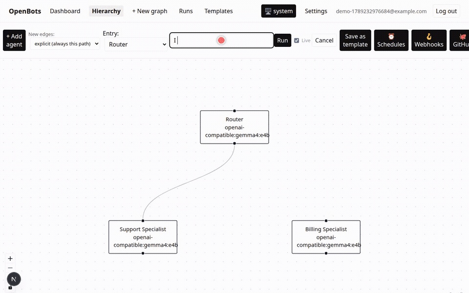

# OpenBots

Open-source, self-hosted, model-agnostic multi-agent orchestration.
Connect any provider — Anthropic, OpenAI, xAI, OpenRouter, or any
OpenAI-compatible endpoint (including local models via Ollama) — and
design agent hierarchies on a live canvas with drag-and-drop routing,
instead of a black-box "just describe your bot" flow.

<p align="center">
  
</p>

Mid-run reroute: drag an edge while a hop is still generating, and the next hop follows the new target.

A "bot" and a "graph" are the same thing: a single-node graph shows up on
the Dashboard as a chat bot with persistent conversation memory; add a
second agent and it becomes a real pipeline you view on the Hierarchy
canvas. Describe a new agent in plain English ("summarizes support
tickets") and a master-agent flow fills in its role, system prompt, and
model for you — or configure everything by hand.

Graphs don't have to stay self-contained, either: one graph can dispatch
work into another graph you own, check back on how that went, or be
granted full read/edit access to restructure it outright — so a single
"portfolio" agent can run an entire fleet of teams, each with agents that
actually read and write real code, push it, and open a PR, all visible
as one live hierarchy.

See [`PLAN.md`](./PLAN.md) for scope, phase status, and an honest running
list of what's verified vs. still untested; [`CLAUDE.md`](./CLAUDE.md)
for architecture notes aimed at an AI pair programmer; and
[`docs/`](./docs) for how the orchestration engine and provider adapters
work in depth.

## What's here

- **Hierarchy canvas** — create agents (manually or via natural-language quick-add), wire routing by dragging between nodes, drag an existing edge to reroute it — even mid-run, if the run was started in `live` mode. Explicit, auto (description-matched), and consensus (fan-out/aggregate) routing all render on the same graph, with live node-pulse/edge-signal animation while a run is actually executing.
- **Dashboard** — a roster of your bots (graphs), each with real multi-turn conversation memory; a multi-agent "team" gets the same one-screen chat experience as a single bot, with the live canvas rendered right alongside it.
- **Per-agent conversation history** — click any node on the canvas to see every run it's ever been part of, distinguishing direct messages from ones another agent routed to it.
- **Agents that write real code** — file read/write tools scoped to one directory per agent; every write lands on an isolated git worktree branch, never your real checkout, auto-committed per hop. Nothing is ever pushed without you typing the literal `/push` command yourself (HTTPS+PAT or SSH) — deliberately never an LLM's judgment call — and `/pr` opens a real pull request once it's pushed.
- **A GitHub tab** — every branch an agent has committed to, grouped with push status, live PR status fetched from GitHub, one-click PR creation, and a real diff viewer, right on the canvas.
- **Scheduled runs** — any graph can run itself on a recurring cron schedule (BullMQ job schedulers, survives a restart), with per-schedule run history.
- **Cross-graph orchestration** — one graph can fire-and-forget dispatch work into another graph you own (`dispatch_to_graph`), check back later on how that run went (`check_dispatch_status`), or be granted full read/edit access to create, update, and delete another graph's agents and routing (`manage_target_graphs`) — held to the exact same file-access and ownership rules a human editing it directly would be. This cross-graph reach renders live on the canvas as connected "gateway" nodes you can click through to that graph's own full editor.
- **Real external data, not just chat-supplied numbers** — a `business_metrics` tool for real conversion/revenue/traffic figures from your own properties, and a local hardware-telemetry tool for a sibling monitoring app, both strictly read-only by design.
- **Reviewer/tier warnings** — a soft, self-declared-tier check that flags when a reviewer agent is a weaker tier than the work it's reviewing.
- **Multi-user auth** — signup/login with scrypt-hashed passwords and signed session cookies; every graph is owned and access-controlled.
- **Usage/cost tracking, cross-provider fallback chains, encrypted per-agent and per-account credentials, a small built-in tool registry** (calculator, current time, file access, dispatch, business metrics, telemetry) — see `docs/adapters.md`.
- **Templates** — save any graph as a reusable, self-contained template; instantiate it into a fresh graph with new node/edge ids.
- **Run replay/audit** — every routing edit and every run's full hop-by-hop trail is persisted.

## Stack

TypeScript monorepo (pnpm + Turborepo): Next.js + React Flow frontend,
Fastify orchestration API + BullMQ worker, Postgres (source of truth),
Redis (job queue + pub/sub for live run status).

```
apps/
  web/   Next.js frontend — hierarchy canvas, dashboard, runs, templates
  api/   Fastify API + orchestration engine + BullMQ worker + e2e/ suite
packages/
  graph-schema/  Shared types + zod validation (agents, edges, runs) — the source of truth for the data model
  providers/     Provider adapters (built on the Vercel AI SDK), pricing, and the tool registry
```

## Getting started

```bash
corepack enable
pnpm install
cp .env.example .env
# fill in at least one model key (ANTHROPIC_API_KEY, OPENAI_API_KEY,
# XAI_API_KEY, OPENROUTER_API_KEY, or OPENAI_COMPATIBLE_BASE_URL), and
# generate the two secrets:
#   openssl rand -hex 32   ->  SESSION_SECRET
#   openssl rand -hex 32   ->  CREDENTIALS_ENCRYPTION_KEY

docker compose up postgres redis -d --wait
pnpm dev   # web + api + worker. The API applies migrations on boot.
```

`.env.example` points Redis at `localhost:6380` because compose publishes that host port (to avoid clashing with a local Redis on 6379). Inside compose, api/worker still talk to `redis:6379`.

The API process only *enqueues* hops; the worker *runs* them. `pnpm dev` starts both. Without a worker, runs stay `pending` forever.

Or run the backend containerized: `docker compose up postgres redis api worker -d`. The API container migrates on start and the worker waits until `/health` is up. The `web` service can also be built with `docker compose up --build web`; if a sandboxed environment's registry connection is flaky on large packages (`next`, `@next/swc-*`), `pnpm --filter @openbots/web build && pnpm --filter @openbots/web start` runs it locally against the dockerized API just as well.

Sign up at `/login`. On the Dashboard, click **Try the live-reroute demo** — that is the graph in the GIF above. Leave **Live** checked, start a run, drag the Router's outgoing edge onto Billing while Router is still generating. **Try the agency demo** creates a fictional Acme Portfolio whose dashed gateway nodes open Payments and Platform team graphs (Lead + Backend / Frontend / Reviewer). Or describe a bot with "+ New bot" (uses whichever model key you set, not just Anthropic).

See `CLAUDE.md` for the full command reference and `pnpm --filter @openbots/api test:e2e` for the real end-to-end test suite (real model calls, no mocks). `pnpm --filter @openbots/api db:migrate` is still there if you want to apply migrations without starting the API; `db:generate` is only for after you edit `apps/api/src/db/schema.ts`.

## License

Apache License 2.0, plus one narrow addition: you can self-host, modify,
fork, and run OpenBots for your own organization (any size) or on behalf
of one consulting client at a time, entirely free — you just can't stand
up your own hosted multi-tenant "OpenBots as a service" for third parties
without a commercial agreement. See [`LICENSE`](./LICENSE) for the exact
terms (GitHub's detector may show this as "Other" rather than
"Apache-2.0" because of that addition — that's expected).
